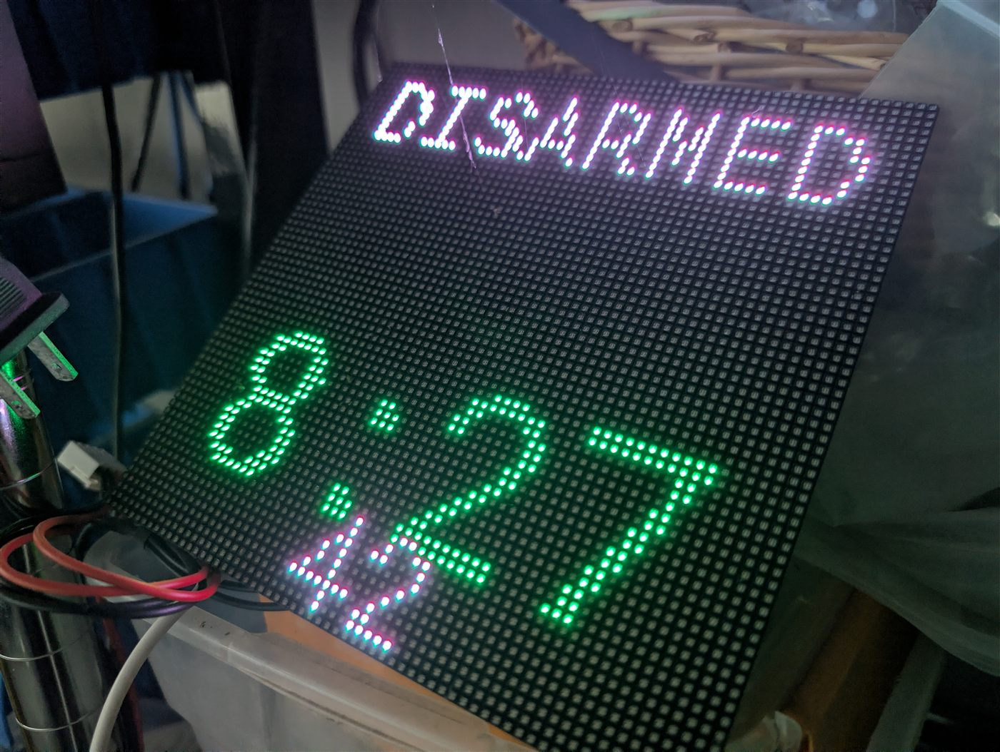
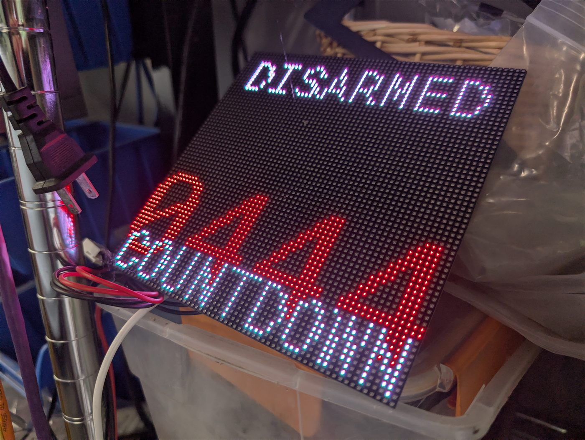

# HUB75 LED matrix — alarm countdown display

**Board:** esp32dev · HUB75 RGB LED matrix

> **Part of the countdown system** — this is an *output*. The countdown comes
> from the rotary dial ([newrotary](../newrotary/)); the sibling display is
> [second-64x64-with-trinity](../second-64x64-with-trinity/).

> Note: the folder is named `32x64-countdown` but the device inside declares
> itself `64x64-countdown`. Historical naming drift on my side — the config is
> the one that runs.

| Clock + armed state | Alarm countdown page |
|:-:|:-:|
|  |  |

Big, legible from across the room, and readable in daylight — which is the whole
point of using a HUB75 panel instead of a small display.

## Status — where this actually stands

**⚠️ Live and running, with one known dead readout and one misleading label.**

A big, readable LED matrix that shows alarm state and a countdown — the thing you
actually look at from across the room while the entry delay is ticking.

### Known issues

- **The countdown sensor is dead.** The `alarmo_time_remaining` entity this reads
  does not exist as a plain entity in current Alarmo — the arming countdown needs
  a Home Assistant **template sensor** to expose it, which I have not built yet.
  Until then the countdown area does not populate. The alarm-state display itself
  works.
- **`pending` is displayed as "ARMING".** That is misleading: `pending` is also
  the state during the *entry* delay, so the sign says ARMING at you while it is
  actually waiting for you to disarm. Cosmetic but genuinely confusing in use.

Both of these are honest bugs, not mysteries — they just need the Home Assistant
side built out. If you fix either, I would take the PR.

### Notes

- Countdown values are consumed from the rotary timer
  ([newrotary](../newrotary/)) in my setup.
- HUB75 pin mappings vary a lot between driver boards — check yours against the
  config before flashing.
- See [second-64x64-with-trinity](../second-64x64-with-trinity/) for the same job
  on an ESP32-Trinity board.

## Usage

Adopt it straight from the ESPHome dashboard:

```
github://gbroeckling/esphome-devices/32x64-countdown/32x64-countdown.yaml@main
```

<details>
<summary>Or include as a package</summary>

```yaml
packages:
  32x64-countdown:
    url: https://github.com/gbroeckling/esphome-devices
    file: 32x64-countdown/32x64-countdown.yaml
    ref: main
    refresh: 1d
```
</details>

Requires `wifi_ssid` / `wifi_password` in your `secrets.yaml` (see the repo root
`secrets.yaml.example`). API encryption keys and OTA passwords were stripped —
the Adopt flow generates your own.
