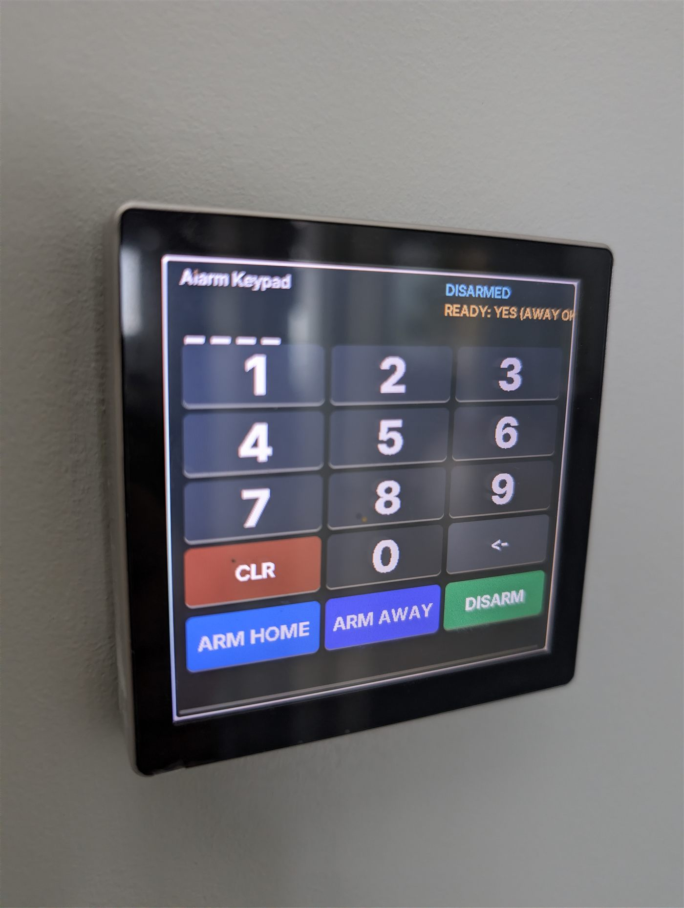
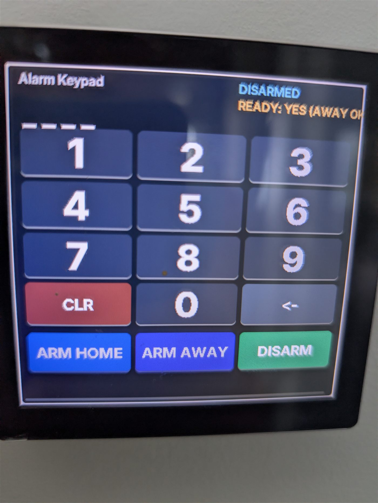

# 480px Alarmo touch keypad

**Board:** ESP32-S3 (4848S040 480×480 touch panel)



| Wall mounted | Keypad screen |
|:-:|:-:|
|  |  |

## Status — where this actually stands

**✅ Running.** One note if you have an existing panel rather than a fresh one —
see below.

A round touchscreen keypad for the [Alarmo](https://github.com/nielsfaber/alarmo)
alarm integration — code entry, arm/disarm, colour-coded state.

### Why my device is behind

The firmware running on my keypad shipped with a **bare `ota:` block, which means
it has no working OTA at all** — port 3232 is closed and refuses connections. It
is still running ESPHome 2025.11.4. I cannot push this config to it over the air;
it needs a one-time USB flash, which is still on my list.

So: **this config is compiled and staged but has not been verified on my hardware
yet.** If you adopt onto a fresh device you get a proper `ota:` block from the
start and none of this applies to you. If you have an existing panel of this type,
check whether port 3232 answers before you assume you can update it.

Lesson worth generalising: **always put a real `ota:` block with a password on a
wall-mounted device.** Anything you have to take off the wall to fix is a device
you will not fix.

### Fixed in this version

- **Arm-away was firing three services at once** — a shotgun approach left over
  from debugging that could race. It is now a single
  `alarm_control_panel.alarm_arm_away` call.
- Real `ota:` block, as above.

### Notes

- Alarmo entity IDs are mine; repoint them before flashing.
- Same panel hardware as [480livingdimmer](../480livingdimmer/).

## Usage

Adopt it straight from the ESPHome dashboard:

```
github://gbroeckling/esphome-devices/480alarmokeypad/480alarmokeypad.yaml@main
```

<details>
<summary>Or include as a package</summary>

```yaml
packages:
  480alarmokeypad:
    url: https://github.com/gbroeckling/esphome-devices
    file: 480alarmokeypad/480alarmokeypad.yaml
    ref: main
    refresh: 1d
```
</details>

Requires `wifi_ssid` / `wifi_password` in your `secrets.yaml` (see the repo root
`secrets.yaml.example`). API encryption keys and OTA passwords were stripped —
the Adopt flow generates your own.
