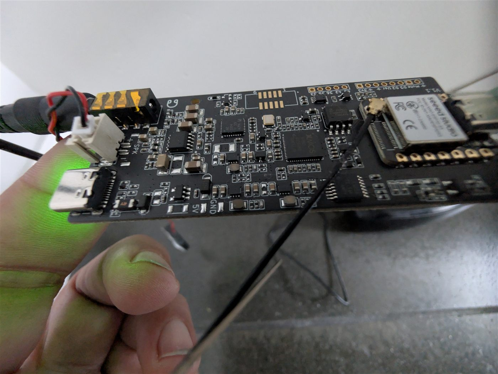

# ReSpeaker Lite voice assistant + Alarmo audio

**Board:** esp32-s3-devkitc-1 · ReSpeaker Lite mic array

| ReSpeaker Lite board | With the XIAO ESP32-S3 seated |
|:-:|:-:|
|  |  |

*The XMOS chip in the middle is the mic array DSP — and it is also the I²S clock
master, which drives the design constraint below.*

## Status — where this actually stands

**✅ Live and verified.** Another board that both hears and speaks, and a good
second choice alongside [stack5echo-voice-assist](../stack5echo-voice-assist/).

Doubles as the audio feedback device for [Alarmo](https://github.com/nielsfaber/alarmo)
— entry/exit/alarm tones — while still working as a general voice assistant
satellite.

### The non-obvious design constraint

**The microphone is the I²S clock master, so it has to keep running while the
assistant is speaking.** If you stop the wake-word engine during TTS to avoid
self-triggering — which is the instinctive thing to do — the clock stops with it
and any secondary speaker on the bus goes silent.

This config **restarts** microWakeWord on `on_tts_start` rather than stopping it.
Keep that in mind before "tidying up" the wake-word handling on a shared I²S bus.

### Other notes

- Build on **ESPHome 2026.7.3 or newer** — the microWakeWord tflite trap described
  in the [repo README](../README.md) applies to this device too.
- Exposes a headphone volume control as a Home Assistant entity.
- Alarmo entity IDs are mine; repoint them before flashing.

## Usage

Adopt it straight from the ESPHome dashboard:

```
github://gbroeckling/esphome-devices/alarmo-audio-generator/alarmo-audio-generator.yaml@main
```

<details>
<summary>Or include as a package</summary>

```yaml
packages:
  alarmo-audio-generator:
    url: https://github.com/gbroeckling/esphome-devices
    file: alarmo-audio-generator/alarmo-audio-generator.yaml
    ref: main
    refresh: 1d
```
</details>

Requires `wifi_ssid` / `wifi_password` in your `secrets.yaml` (see the repo root
`secrets.yaml.example`). API encryption keys and OTA passwords were stripped —
the Adopt flow generates your own.
