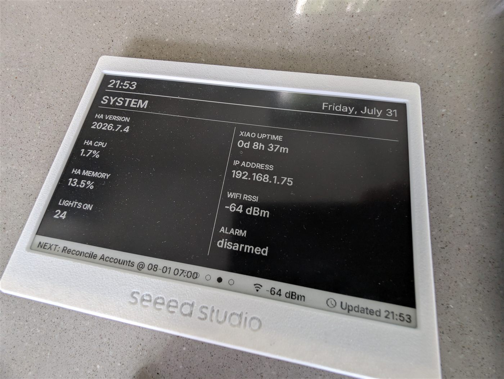

# XIAO 7.5" e-paper calendar

**Board:** esp32-c3-devkitm-1 (Seeed XIAO ESP32-C3) · 7.5" black & white e-paper



*The SYSTEM view. Note the date in this photo — see the status below.*

## Status — where this actually stands

**⚠️ The config is good and was verified working on 2026-07-31. The device is
offline right now.**

I need to be straight about this, because the photo above is a trap I nearly fell
into myself. It was taken on 2026-08-05, but the display reads **Friday, July 31,
updated 21:53**. E-paper holds its last rendered image with no power — so what
you are looking at is a frozen render, not a live screen. Checking Home
Assistant confirms it: every device-side entity (`..._ip`, `..._uptime`,
`..._wifi_rssi`) reports `unavailable`.

So the device has not updated since the evening of July 31. The cause is almost
certainly power or Wi-Fi at my end rather than the config — it ran verified for
hours after flashing — but I have not diagnosed it yet, and I am not going to
claim "live and verified" while it is dark.

**If you build this: e-paper looking correct is not proof the device is alive.**
Check the uptime entity, not the screen. That is worth designing for — the config
puts uptime and "updated HH:MM" on the display for exactly this reason, and it
still fooled me at a glance.

Five rotating views, driven entirely from Home Assistant entities. This started
as a 1078-line config and came out of a rewrite at 423 lines doing more than the
original did.

### What it shows

- **108px minute-accurate clock**, refreshed on the minute boundary
  (`on_time` with `seconds: 0`). An earlier version of this display drifted, and
  carried a crude "+10 minutes" lookahead hack to compensate — refreshing on the
  minute boundary removed the need for it entirely.
- Weather with today's high/low
- Six MDI tiles: indoor temperature, lights, alarm state, two garage doors, and
  presence areas
- A merged multi-calendar timeline, sorted by start time with per-calendar source
  labels, handling all-day (date-only) events
- Footer on **every** view showing the next upcoming event. An earlier rebuild put
  calendar info only on a dedicated calendar page — that turned out to be a real
  downgrade in daily use, so it went back on all views.
- System footer: Home Assistant version, update-available flag, Wi-Fi RSSI, last
  update time

### Things that bit me

- **Fonts need explicit glyph lists.** ESPHome's default glyph set does not
  include `@`, `~` or `&`. Any of those in your labels silently vanish. This
  config declares them explicitly.
- Fonts pull from Google Fonts (Inter) at compile time rather than local files, so
  there is no dependency on a `fonts/` directory in your config folder.
- The Home Assistant version readout has to come from the
  `update.home_assistant_core_update` entity's `installed_version` attribute —
  the obvious-looking sensors are dead ends.
- Entity IDs in this config are mine. Search for `sensor.` / `binary_sensor.` and
  point them at yours before flashing.

## Usage

Adopt it straight from the ESPHome dashboard:

```
github://gbroeckling/esphome-devices/e-ink-bw/e-ink-bw.yaml@main
```

<details>
<summary>Or include as a package</summary>

```yaml
packages:
  e-ink-bw:
    url: https://github.com/gbroeckling/esphome-devices
    file: e-ink-bw/e-ink-bw.yaml
    ref: main
    refresh: 1d
```
</details>

Requires `wifi_ssid` / `wifi_password` in your `secrets.yaml` (see the repo root
`secrets.yaml.example`). API encryption keys and OTA passwords were stripped —
the Adopt flow generates your own.
