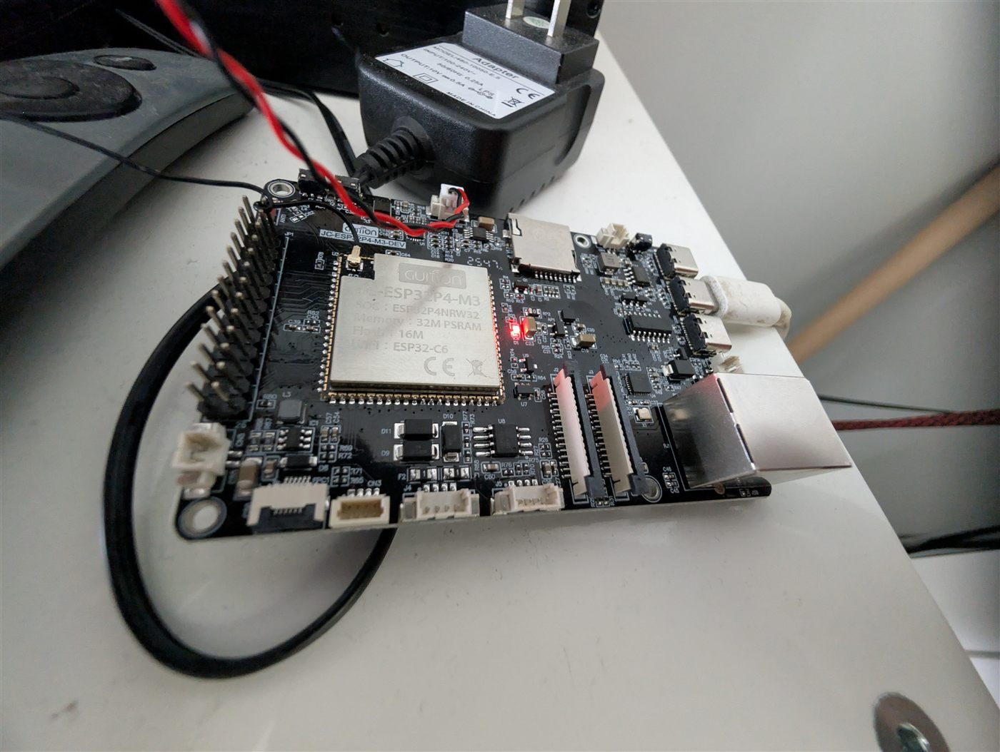

# Guition ESP32-P4 voice assistant — speaker half

**Board:** Guition ESP32-P4, 16MB flash · Wi-Fi via onboard ESP32-C6 (`esp32_hosted`)



*The module label tells you what you're getting: ESP32P4NRW32, 32M PSRAM, 16M
flash, Wi-Fi via an onboard ESP32-C6. The RJ45 at the right is the Ethernet port
described below — the one that stopped working.*

## Status — where this actually stands

**Live and running. This board is the *voice* of a two-board voice assistant.**

Text-to-speech playback is verified working. In my setup it receives replies
relayed from [voice7exp](../voice7exp/), which carries the microphone and the
wake word. I have not yet got a single ESP32-P4 doing both microphone and
speaker — see the P4 section in the [repo README](../README.md).

The device is still named `jarvis-p4-eth` from when it ran wired Ethernet. **It
runs Wi-Fi now** and the Ethernet block is commented out in the config. Rename it
if that bothers you.

### Known rough edges

- **Ethernet died and I never recovered it.** The wired run lost electrical link
  after a physical move — switch port healthy and enabled, zero link after a board
  power-cycle. The PHY initialises clean on serial, so the firmware is not at
  fault; it is a cable, jack, or board-RJ45 problem I have not chased down. I
  switched it to Wi-Fi through the onboard C6 instead, with power save off.
- **Losing the network means losing OTA.** With no link there is no way to push a
  fix over the air, and I had to recover it over USB:
  ```
  esptool --chip esp32p4 write_flash 0x0 firmware.factory.bin
  ```
  on the board's CH340 UART port. Worth knowing before you commit to Ethernet on
  a P4 that lives somewhere awkward.
- **P4 display builds boot-loop without a PSRAM flag.** If you extend this config
  with a display, you will likely hit an assert in `cache_utils.c` on every NVS
  write. The fix is `esp32.framework.advanced.execute_from_psram: true` plus
  the matching ESP-HOSTED sdkconfig options.
- No fixed IP reservation on the Wi-Fi MAC yet — note that the Wi-Fi MAC is the
  C6's and differs from the Ethernet MAC.

## Usage

Adopt it straight from the ESPHome dashboard:

```
github://gbroeckling/esphome-devices/p4-voice-assist-guition/p4-voice-assist-guition.yaml@main
```

<details>
<summary>Or include as a package</summary>

```yaml
packages:
  p4-voice-assist-guition:
    url: https://github.com/gbroeckling/esphome-devices
    file: p4-voice-assist-guition/p4-voice-assist-guition.yaml
    ref: main
    refresh: 1d
```
</details>

Requires `wifi_ssid` / `wifi_password` in your `secrets.yaml` (see the repo root
`secrets.yaml.example`). API encryption keys and OTA passwords were stripped —
the Adopt flow generates your own.
