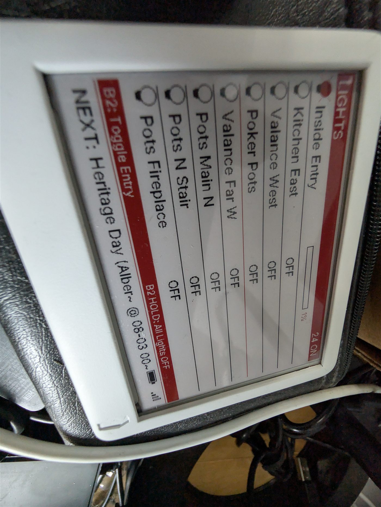

# Paperd.ink Merlot e-paper calendar

**Board:** esp32dev (Paperd.ink Merlot) · tri-colour e-paper, battery powered,
4 physical buttons



*The LIGHTS view, with the red accent bars this panel supports.*

## Status — where this actually stands

**✅ Running. Verified and flashed 2026-07-31.**

### What it shows

Seven views on a 2-minute rotation: calendar, clock, weather, status, an 8-row
light brightness bar chart, who's home, and pending updates. Plus battery voltage
and charging state, and the four physical buttons.

### Things fixed while modernising it

- **Dead entity references replaced**: the updates counter, and the Home Assistant
  version (which has to come from `update.home_assistant_core_update`'s
  `installed_version` attribute).
- **Garage display rebuilt** around two door contacts with Car / Truck / Both Open
  logic, replacing a dead tilt sensor.
- **Removed a "+10 minutes" clock lookahead hack.** Both of my e-paper configs
  carried it to compensate for refresh lag. The correct fix is refreshing on the
  minute boundary — see [e-ink-bw](../e-ink-bw/).
- **Fonts moved from local DejaVu files to Google Fonts (Inter)** with extended
  glyph sets, which removes the dependency on a local `fonts/` directory.

### Notes

- **There is no `deep_sleep` in this config.** If the panel stops updating it is
  unpowered or the battery is flat — it is not sleeping. Worth knowing before you
  go hunting for a power-management bug that isn't there.
- Deliberately kept feature-complete rather than trimmed: all seven views, all
  four buttons, the red accent colour, the 2-minute rotation.
- Entity IDs are mine; repoint them before flashing.

## Usage

Adopt it straight from the ESPHome dashboard:

```
github://gbroeckling/esphome-devices/paperd-calendar/paperd-calendar.yaml@main
```

<details>
<summary>Or include as a package</summary>

```yaml
packages:
  paperd-calendar:
    url: https://github.com/gbroeckling/esphome-devices
    file: paperd-calendar/paperd-calendar.yaml
    ref: main
    refresh: 1d
```
</details>

Requires `wifi_ssid` / `wifi_password` in your `secrets.yaml` (see the repo root
`secrets.yaml.example`). API encryption keys and OTA passwords were stripped —
the Adopt flow generates your own.
