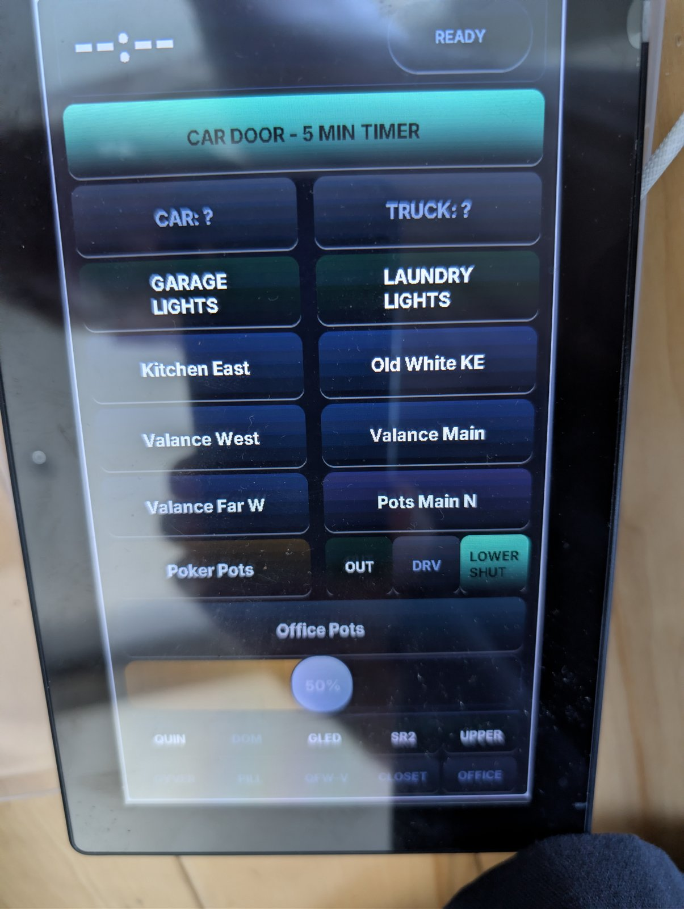
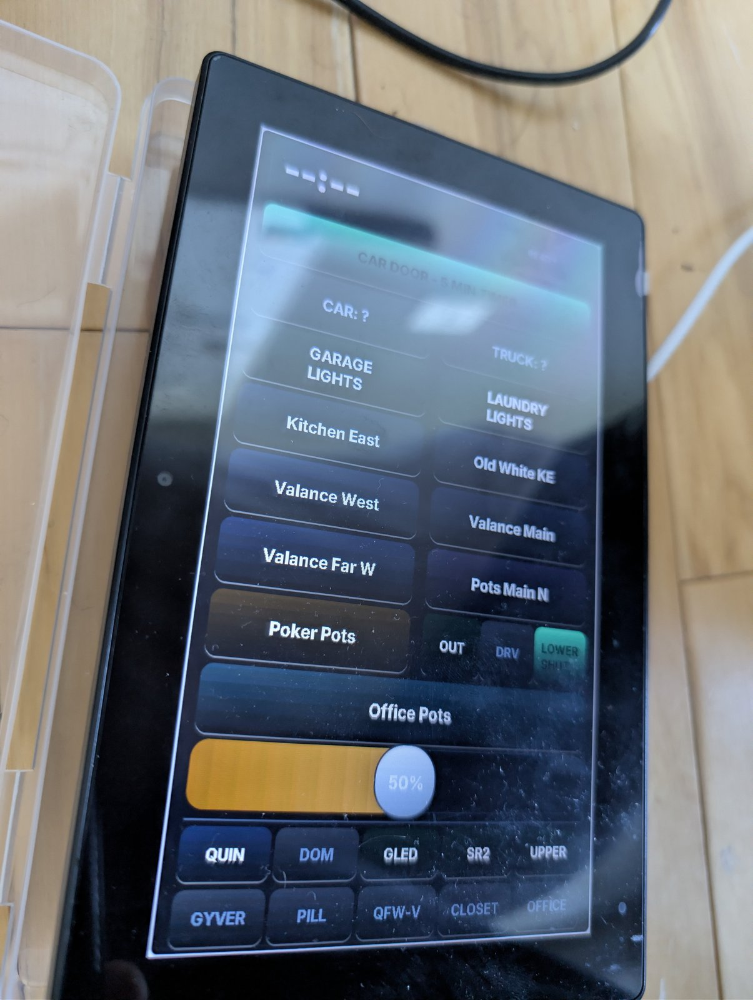

# ESP32-P4 voice satellite — microphone half

**Board:** esp32p4, 16MB flash · Wi-Fi via onboard ESP32-C6 (`esp32_hosted`)
**Mic:** external INMP441-style I²S microphone
**Wake word:** microWakeWord (`hey_jarvis`)

| The touch dashboard | Panel and bezel |
|:-:|:-:|
|  |  |

*The same board that carries the microphone also runs an LVGL touch dashboard —
car-door timer across the top, house lights below, WLED presets at the bottom.*

## Status — where this actually stands

**✅ Running, verified end to end 2026-08-04** — wake word spoken at the panel,
reply audible from the paired speaker board. This board is the *ears* of a
two-board voice assistant, not a complete one.

It hears the wake word, streams to the Home Assistant pipeline, and then hands the
spoken reply off to a **second** ESP32-P4 ([p4-voice-assist-guition](../p4-voice-assist-guition/))
which has the speaker. It does not answer out loud by itself.

I have not yet got a single ESP32-P4 doing both microphone and speaker. This
split is the workaround that made office voice work at all. See the P4 section in
the [repo README](../README.md) before you buy hardware expecting otherwise.

**Verified:** wake engine loads and stays in detect state, mic streams to the
pipeline, and spoken replies come back out of the paired board.

### Known rough edges

- **Build it on ESPHome 2026.7.3 or newer.** On 2026.2.1 the tflite runtime cannot
  load current microWakeWord models — it throws `Failed to allocate tensors for the
  streaming model`, the wake engine quietly dies, and the device looks perfectly
  healthy while being completely deaf. This is the single worst failure mode in
  this repo.
- **Wake word must be restarted on TTS start.** Without it the mic can stop
  detecting after the first exchange.
- Display colours render inverted compared to the sibling P4 config — cosmetic,
  unfixed.
- This is the config I intend to rebuild as a clean showcase. It carries history.

## Usage

Adopt it straight from the ESPHome dashboard:

```
github://gbroeckling/esphome-devices/voice7exp/voice7exp.yaml@main
```

<details>
<summary>Or include as a package</summary>

```yaml
packages:
  voice7exp:
    url: https://github.com/gbroeckling/esphome-devices
    file: voice7exp/voice7exp.yaml
    ref: main
    refresh: 1d
```
</details>

Requires `wifi_ssid` / `wifi_password` in your `secrets.yaml` (see the repo root
`secrets.yaml.example`). API encryption keys and OTA passwords were stripped —
the Adopt flow generates your own.

To pair it with a speaker board, point the `on_tts_start` relay at your own
media player entity.
